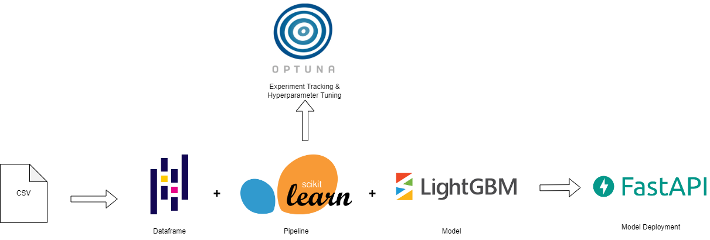
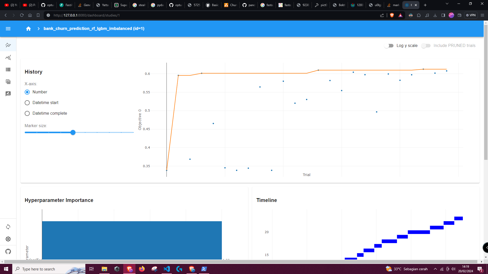
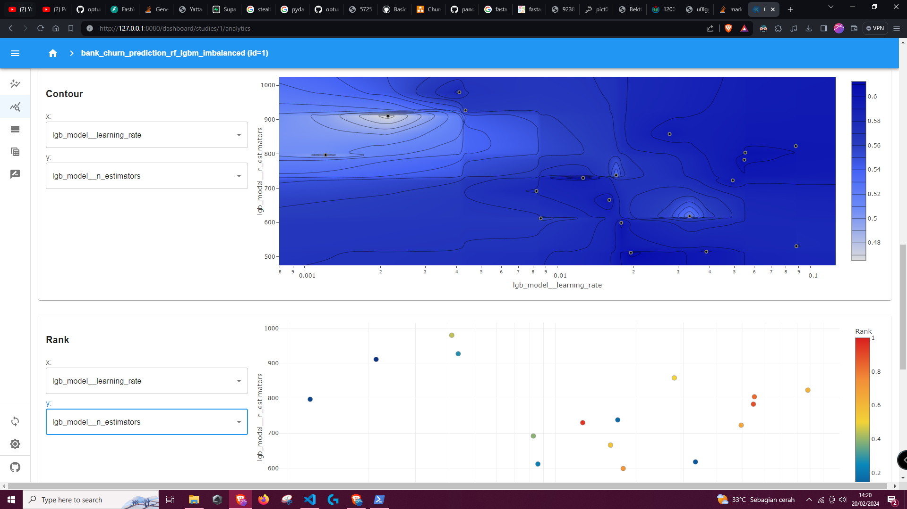
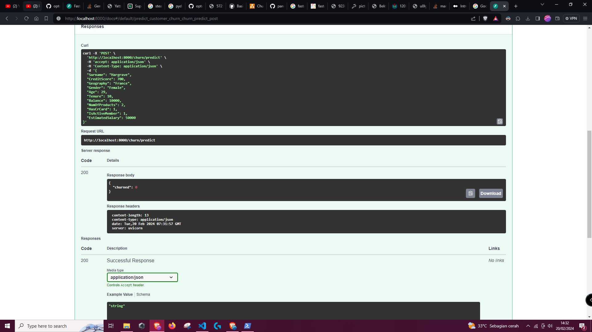
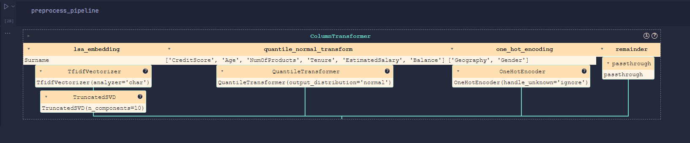

# End-to-End Machine Learning Project: Bank-Churn-Prediction
This repository hosts my machine learning portfolio project of creating an end-to-end machine learning solutions for banks to predict customer churn, from data cleaning to API.

## Folder Structure
All the important code, both for training model and deploying API are in the `prod` folder. 
The data used for training are located at the `data` folder.
The `protyping` folder contains code that i use to do some test run while building this project. 
The three powershell `.ps1` script at the root are used to setup python virtual environment, re-train model and re-deploy API.

## Tech Stack
  
For this project, i'm using the following technologies:
- **Dataframe:** [Pandas](https://github.com/pandas-dev/pandas)
- **Pipelines & Models:** [Scikit-learn](https://github.com/scikit-learn/scikit-learn)
- **Models:** [LightGBM](https://github.com/microsoft/LightGBM)
- **Hyperparameter Optimization:** [Optuna](https://github.com/optuna/optuna)
- **Experiment Tracking:** [Optuna-Dashboard](https://github.com/optuna/optuna-dashboard)
- **API:** [FastAPI](https://github.com/tiangolo/fastapi)

## Running The Project
To replicate the results i've obtained, you can run these powershell scripts in this order:
```
./setup.ps1
./train.ps1
```
After both of those script finished executing, you can open [http://localhost:8080/](http://localhost:8080/) to view the experiment tracking dashboard that shows the hyperparameter combination and the resulting metrics. You can also view the result in the [jupyter notebook](prod/Churn_Classification_Pipeline.ipynb) used to do the computation.  
If you are satisfied with the resulting best model, you can serve it using the following script:
```
./start_server.ps1
```
The API will live in [http://localhost:8080/](http://localhost:8080/). FastAPI will also automatically generate a Swagger dashboard for testing and documentation that can be accessed in [http://localhost:8000/docs](http://localhost:8000/docs). if you want to test using another tech like Postman, you can fire POST request to [http://localhost:8000/churn/predict](http://localhost:8000/churn/predict) with JSON format supplied in the Swagger docs.

Below is the screenshot of the Optuna dashboard:  
  
  

Below is the screenshot of the Swagger dashboard:  
  
  

**Note:** as this project uses powershell script, if left as it is, it will only work on windows. 
But it should be able to work on linux or mac if you change the file extension from `.ps1` to `.sh` as i did not use any windows specific command.

## Viewing The Jupyter Notebook
Most of the modeling code (EDA, Feature Engineering / Pipeline, and Model Tuning) are written in jupyter notebook and run using powershell and nbconvert. To view the resulting jupyter notebook, you can use the following [link](prod/Churn_Classification_Pipeline.ipynb), to view it in this github repo. or use the following [link]() to view it as a website in nbviewer.  

## The Project at a Glance
Link to the dataset source and data dictionary: [https://www.kaggle.com/datasets/radheshyamkollipara/bank-customer-churn](https://www.kaggle.com/datasets/radheshyamkollipara/bank-customer-churn)  
The dataset contains the characteristics of the bank's customers and a label of whether they churned in timeframe of the data collection. Due to the nature of the label (discrete and binary), this model that we will make will be a classification model.

The project consists of the following steps:
1. **Data Loading and Cleaning:** in this steps we load dataset, deleted the rowNumber variable (as it is just a row number and hence, uninformative), and de-duplicate the data.
2. **Missing Value Checks:** we viualize missing value using missingno and found that there are exactly 4 rows of data that has missing values, we will impute them later in the feature engineering step.
3. **EDA:** for categorical data, we visualize the proportion using bar chart. For numerical data we visualize the distribution with a histogram and their range or spread with boxplot.
4. **Feature Engineering:**
    We willsplit the data into training and testing set in 75-25 proportion and create the following pipeline based on the data type of each variable.
    * **numerical:** for the numerical variable creditscore, age, numofproduct, tenure, balance, and estimatedsalary we will do normalization and scaling using quantile normal transform. A method that is robust to outlier, as some of these variables are known to have outliers. Nothing will be done for 'HasCrCard', 'IsActiveMember' as it is already in the format that we desire (binary numerical variable of 0s and 1s)
    * **catagorical:** for the categorical variables Geography and Gender, we will use one-hot encoding.
    * **text:** for the text variable surname, due to the fact that there are 2932 unique name, if we use one-hot encoding, it will create a very sparse data that is hard to learn by most estimator / model. In order to circumvent that we will use tfidfvectorizer with analyze='char' to vectorize it at a character level (surnames are only 1 word), then we will reduce the dimensionality of the vector to 10 using SVD (Singular Value Decomposition), based on our observation that there are 6 language group present in the surnames (we give an extra in case there is an a language-family that i didn't catch). This method is similar to LSA (Latent Semantic Analysis) embedding, the difference being that LSA usually vectorizes the sentence at word level.
    The pipeline will be implemented with scikit-learn, it will look like this:
    
5. **Modeling:** we will try two model for this project, gradient boosting tree (using lightgbm) and random forest (using scikit-learn). This selection of model is due to the recent [literature](https://arxiv.org/abs/2207.08815) which states that gradient boosting and random forest still outperform deep learning in tabular settings (where the data is in tables, like this one). Furthermore we use random forest and lightgbm due to the fact that both of those model support the use of class weights and sample weights for classification with imbalanced dataset, such as the one used for this project. For the tuning objective function, we chose the f1 function as the data is imbalanced and ordinary accuracy measure might mislead us. We will then use Optuna for hyperparameter tuning with the tuning space defined as follows:

```
def objective(trial):
    sample_weights = compute_sample_weight(class_weight='balanced', y=y_train)
    scale_pos_weight = y_train.value_counts()[0] / y_train.value_counts()[1]
    
    clf = trial.suggest_categorical('classifier', ['rf', 'lgbm'])
    
    if clf == 'rf':
        
        bootstrap = trial.suggest_categorical('rf_model__bootstrap', [True, False])
        class_weight = trial.suggest_categorical('rf_model__class_weight',["balanced_subsample","balanced"])
        max_depth = trial.suggest_int('rf_model__max_depth', 2, churn.shape[1])
        max_features = trial.suggest_categorical('rf_model__max_features', ['sqrt', 'log2'])
        max_leaf_nodes = trial.suggest_int('rf_model__max_leaf_nodes', 5, 15)
        criterion = trial.suggest_categorical('rf_model__criterion',['gini', 'entropy'])
        n_estimators = trial.suggest_int('rf_model__n_estimators', 500, 1000)
        
        params = {
            'rf_model__bootstrap': bootstrap,
            'rf_model__class_weight': class_weight,
            'rf_model__max_depth': max_depth,
            'rf_model__max_features': max_features,
            'rf_model__max_leaf_nodes': max_leaf_nodes,
            'rf_model__criterion': criterion,
            'rf_model__n_estimators': n_estimators
        }
        
        clf_pipe = Pipeline(
            steps = [
                ('preprocessor', preprocess_pipeline),
                ('rf_model', RandomForestClassifier(random_state = 0, n_jobs = -1))
            ]
        )
        
        clf_pipe.set_params(**params)
        
        
        f1 = cross_val_score(clf_pipe, X_train, y_train, cv=5, scoring = 'f1', params = {'rf_model__sample_weight': sample_weights}).mean()
            
        return f1
    
    if clf == 'lgbm':
        
        colsample_bytree = trial.suggest_float('lgb_model__colsample_bytree', 0.5, 1)
        learning_rate = trial.suggest_loguniform('lgb_model__learning_rate', 0.001, 0.1)
        max_depth = trial.suggest_int('lgb_model__max_depth', 2, 20)
        num_leaves = trial.suggest_int('lgb_model__num_leaves', 20, 100)
        n_estimators = trial.suggest_int('lgb_model__n_estimators', 500, 1000)
        reg_alpha = trial.suggest_loguniform('lgb_model__reg_alpha', 0.001, 10)
        reg_lambda = trial.suggest_loguniform('lgb_model__reg_lambda', 0.001, 10)
        subsample = trial.suggest_float('lgb_model__subsample', 0.5, 1)
        pos_weight = trial.suggest_categorical('lgb_model__scale_pos_weight',[scale_pos_weight])
        
        params = {
            'lgb_model__colsample_bytree': colsample_bytree,
            'lgb_model__learning_rate': learning_rate,
            'lgb_model__max_depth': max_depth,
            'lgb_model__num_leaves': num_leaves,
            'lgb_model__n_estimators': n_estimators,
            'lgb_model__reg_alpha': reg_alpha,
            'lgb_model__reg_lambda': reg_lambda,
            'lgb_model__subsample': subsample,
            'lgb_model__scale_pos_weight':pos_weight
        }
        
        clf_pipe = Pipeline(
            steps = [
                ('preprocessor', preprocess_pipeline),
                ('lgb_model', lgb.LGBMClassifier(device="gpu", random_state = 0, objective='binary', verbose = -1))
            ]
        )
        clf_pipe.set_params(**params)
        
       
        f1 = cross_val_score(clf_pipe, X_train, y_train, cv=5, scoring = 'f1', params = {'lgb_model__sample_weight': sample_weights}).mean()
            
        return f1
```
Our best hyperparameters, yields the following result on the test set:
```
Score on Testing Set:
--------------------
Accuracy Score: 0.8076
Balanced Accuracy Score: 0.7183077200009
AUC Score: 0.7183077200009
F1 Score: 0.597489539748954
Precision Score: 0.7013752455795678
Recall Score: 0.5204081632653061
Sensitivity Score: 0.7013752455795678
Specificity Score: 0.8347564038171773
              precision    recall  f1-score   support

           0       0.92      0.83      0.87      1991
           1       0.52      0.70      0.60       509

    accuracy                           0.81      2500
   macro avg       0.72      0.77      0.74      2500
weighted avg       0.84      0.81      0.82      2500
```
6. **Modeling:** The best model that we found after hyperparameter tuning will then be implemented on the full data and served using fastAPI. 
The code for the creating the api is [main.py](prod/main.py)
